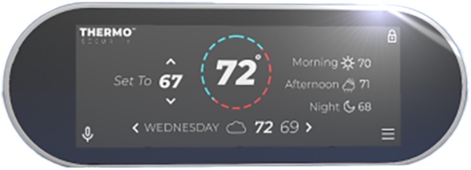

<h1 color="#adff2f" allign="center"> Hackathon </h1>

The basis of this assignment is to create an interactive application using 3D, video, and still images.
Design and develop an engaging experience for the end-user with which they can interact in a one-page
mobile-first web application.

## Product Description

HouseCom™ ThermoSecurity™ System is a fully digital, hardwired and wireless (WiFi, Bluetooth)
enabled home personal and secure environment control system. All communications with the central
system are accessible and controlled through the wall unit, product app. and the secured portal on the parent
website. The HouseCom™ ThermoSecurity™ System App. is available on both iOS and Android devices.

## Assignment Requirements

MMED-3038

Generate brand identity collateral that will position your HouseCom™ ThermoSecurity™ System product
against the competition on the store shelves. Create the specific functionality of the HouseCom™
ThermoSecurity™ System and the GUI (graphical user interface) that will be a part of the industrial design
for the actual HouseCom hardware and software. Design one page sell sheet for this product that provides all the ‘relevant’ information for this particular product.
“HouseCom™ ThermoSecurity™ System”

MMED-1058

Each group is required to model and render images of a smart thermostat for use in an interactive
application. Each group is responsible for all stages of this product, from modeling to final GI render.

MMED-3040

Each team needs to design and build a database in MySQL that contains all the relevant information and use
the appropriate SQL query for fetching data. Please use multiple tables for this assignment with the
appropriate number of fields and the proper types set for each field matching the object data created for
MMED-3039. Please provide me with the SQL queries to match the retrieved content in a text file along with
the database in your repo.

MMED-3039

Each team will develop a responsive mobile-first application using JSON for data to showcase an interactive
implementation of your design. Please note that this means that you can consider how the graphics and
interactivity evolve as a web app. Use media queries, etc to control the visual flow.

## Technical Specs

1. HTML5
2. SASS/CSS3
3. JavaScript
4. MAMP
5. Cinema 4D
6. Adobe XD, PS, AI

## Credits

MMED-3038: Ameem Rahman (Brand Designer)

MMED-1058: Kalonga Emanuel Kabongo (Motion Designer) 

MMED-3040: Immama Ayoub (Web Developer)

MMED-3039: Aixin Zhong (SQL Developer)

## License
MIT
